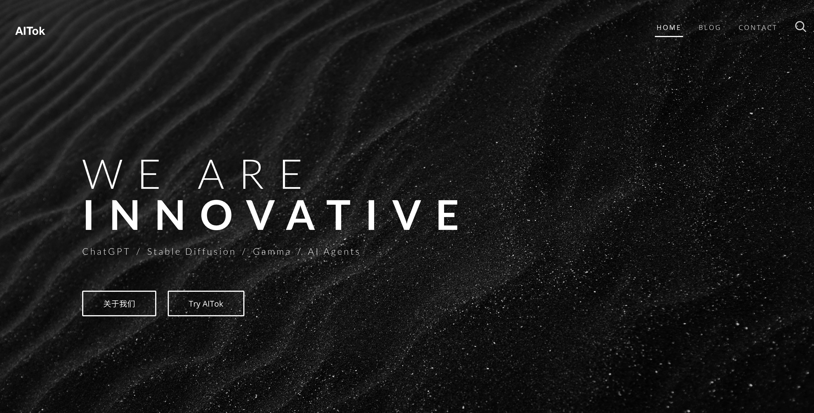

# AITok Introduction: :hotsprings:
Official Web ([Home](https://aitok-china.com/)) 
Use our app: ([AITok](https://chat.aitok.us/chat/new))

 The Enhanced AI Conversation System is a project inspired by ChatGPT, aiming to combining additional features to enhance user experience, security, and functionality. Most importantly, our application is mainly designed for mainland Chinese users, because they are not able to chatGPT due to strict security policy. 
 
 ### My role as the Full-stack engineer encompasses several key tasks, including:

- Developing a sensitive word filtering system
- Adding new features so users can uploads PDFs and Docs, and ask questions based on the input files
- Addressing UI bugs
- Creating the project's official website

