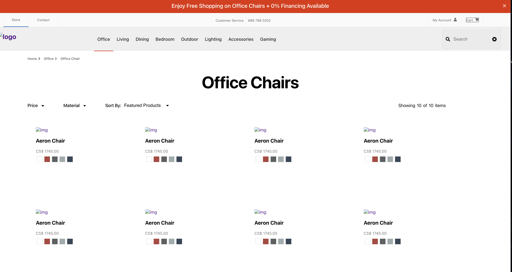

# E-commerce projects overview

**Company:** ITLabPro Group  
**Location:** Markham, ON, Canada  
**Duration:** 04/2022 - 07/2023

## **Lululemon Clone** 

  

## **Herman Miller Clone**
- no images due to API server shutdown by ITLabPro
  

## What I have achieved
During my comprehensive Full Stack Developer Bootcamp and Internship, I gained valuable experience in the development of two e-commerce platforms within distinct Agile teams. My contributions included:

- **`Collaborative Development`**: I actively participated in the end-to-end development of two e-commerce platforms, collaborating closely within Agile teams. By utilizing React and Redux frameworks, I contributed to crafting responsive and dynamic user interfaces that elevated the overall shopping experience.

- **`Performance Optimization`**: To address crucial website loading speed challenges, I effectively employed advanced Redis caching techniques and implemented strategic lazy loading strategies. These optimizations resulted in a remarkable 20% reduction in load time, leading to enhanced user satisfaction and retention rates.

- **`Enhanced Security`**: I implemented JSON Web Token (JWT) to ensure secure user authentication, establishing a higher level of data protection. This implementation contributed to creating a trustworthy shopping environment for customers.

- **`Microservices Advocacy`**: Within the project, I actively participated in discussions centered around microservices architecture. Through advocating for its adoption, I emphasized the potential for scalability and improved maintenance, setting the stage for future platform growth.

- **`Team Collaboration`**: Engaging in code reviews, brainstorming sessions, and proactive knowledge sharing, I contributed to a positive team environment that encouraged creativity and innovation.
